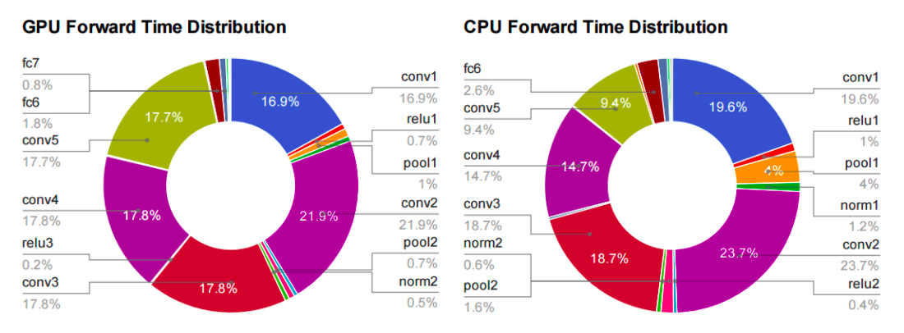
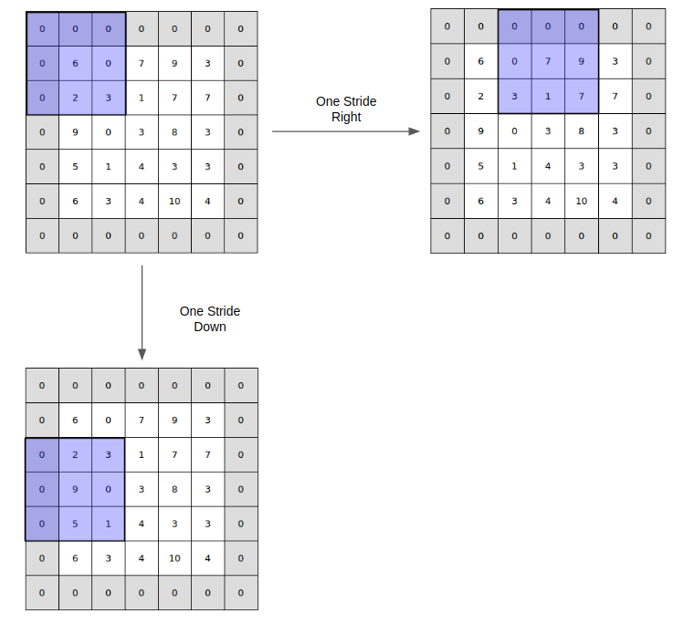
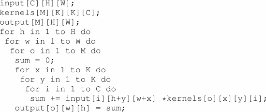
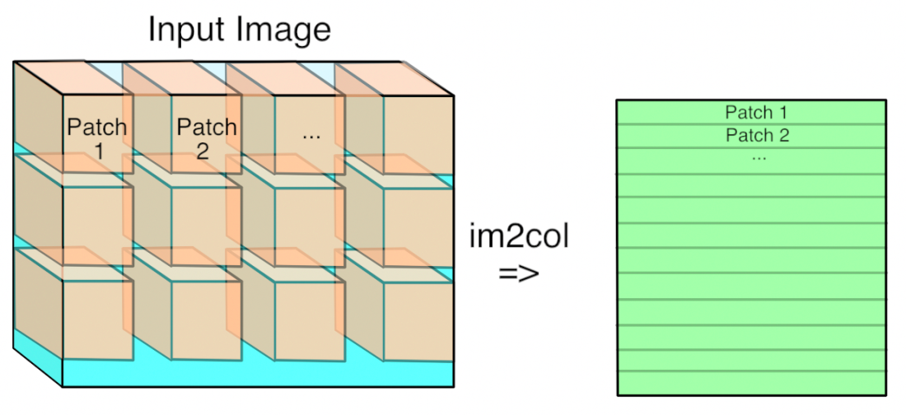
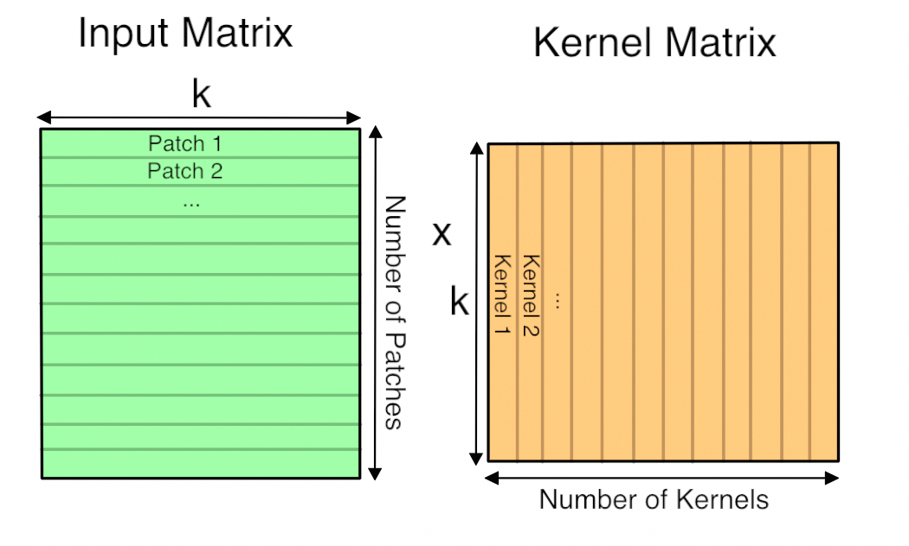

# HEART OF **DEEP** -LEARNING
####_Optimizing Convolution for memory limited devices_

Ashutosh Jatav (B16CS004)

### Introduction **:**

Machine Learning, especially deep learning has been a core algorithm to be widely used in many fields such as natural language processing, object detection, etc. Deep learning algorithm like convolutional neural network and its variants consumes a lot of memory resources. In such a case powerful deep learning algorithms are difficult to apply on mobile memory limited platforms. For this purpose, we have analyzed several methods to optimize convolution in a convolutional neural network.

# Methodology

###GEMM:

All the layers that start with fully-connected or convolution are implemented using GEMM and almost all the time is spent on those layers

GEMM: General Matrix to Matrix Multiplication what it does is it multiplies two input matrices together to get an output one.

So, for example single layer in the typical network may require multiplication of 256 rows and 1152 column matrix by a 1512 row, 192 col matrices to produce a 256 row, 192 columns result. That require 57 million floating point operations and there can be dozens of these layers in a modern architecture. So a network may need a billion FLOPs to calculate a single frame

**Fully – Connected Layers:**

 For each output value of an FC layer looks at every value in input layer, multiplies them all by the corresponding weight it has for that input index and sums the result to get its output.

**Convolutional Layers:**

The convolutional layer treats its input as a two-dimensional image, with a number of channels for each pixel. The convolutional operation produces its output by taking a number of kernels of weights and applying them across the image. Kernel contains a pattern weights when the part of the input image it&#39;s looking at has a similar pattern it outputs a high value.

CNN uses parameter sharing of weights by neuron in a particular feature map, this works in a way by assuming that if one feature is useful to compute at some spatial position (x,y) then it should also be useful to compute at a different position(x&#39;, y&#39;) in other words let&#39;s say a volume size of [x, y, d] has d depth slice each of [x,y].

neurons in each depth slice are constrain to use the same weights and bias so there would be only d unique weights in this case instead of x\*y\*d.

As an example, we have an image, or tensor, with the width ( **W** ), height ( **H** ), and depth ( **D** ). We also have a patch called filter sized **F** in height &amp; width and depth **D.** We apply **K** number of filters with that size to the input. The pseudo code as follows:

**GEMM in Convolution layer:**

1.) Turn the input image 3D array into a 2D array that can be treat like a matrix. Where each kernel is applied is little 3-D cube within the image so we can take each one of these cube of input values and

copy them out as a single column into a matrix step is known as image-to-column

The number of strides is two ( **S** = 2), which means our filter will move through the spatial dimension of the input patch, two elements at a time. Starting from the top left, all the way until it covered all of the input elements to the bottom right. In our case, we will end up with 9 spatial patches.

If the stride is less than the kernel size then pixels that are included in overlapping kernel sites will be duplicated in the matrix which is inefficient.

Same thing will be done for kernel&#39;s weights

 k is number of values in each patch and kernel so it&#39;s kernel width \* kernel height \* depth. The resulting matrix is &#39;Number of patches&#39; columns high, by &#39;Number of kernel&#39; rows wide. This matrix is actually treated as a 3D array by subsequent operations, by taking the number of kernels dimension as the depth and then splitting the patches back into rows and columns based on their original position in the input image.

## References

[1] CS231n Convolutional Neural Networks. [http://cs231n.github.io/convolutional-networks/](http://cs231n.github.io/convolutional-networks/), 2018

[2] Convolution in Caffe: a memo. [https://github.com/Yangqing/caffe/wiki/Convolution-in-Caffe:-a-memo](https://github.com/Yangqing/caffe/wiki/Convolution-in-Caffe:-a-memo), 2018

[3] Caffe Installation. [http://caffe.berkeleyvision.org/installation.html](http://caffe.berkeleyvision.org/installation.html), 2018

[4] Netlib BLAS. [http://www.netlib.org/blas/](http://www.netlib.org/blas/), 2018

[5] Nvidia cuBLAS. [https://developer.nvidia.com/cublas](https://developer.nvidia.com/cublas), 2018

[6] [https://ieeexplore.ieee.org/document/7995254](https://ieeexplore.ieee.org/document/7995254)

[7] [https://www.groundai.com/project/the-indirect-convolution-algorithm/1](https://www.groundai.com/project/the-indirect-convolution-algorithm/1)

[8[ https://arxiv.org/pdf/1706.06873.pdf](../../D:%5CMaterial%5CML%5C%5D%20https:%5Carxiv.org%5Cpdf%5C1706.06873.pdf)

# HEART OF **DEEP** -LEARNING - II

###_Optimizing Convolution for memory limited devices_

Ashutosh Jatav (B16CS004)
