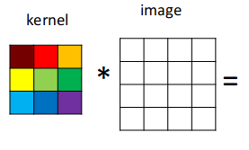
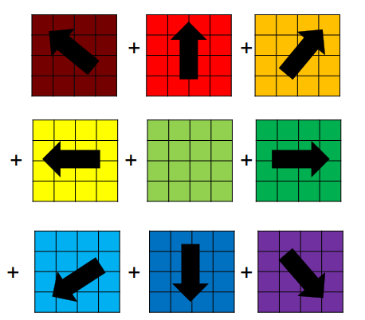
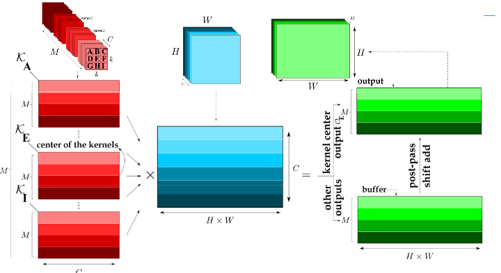
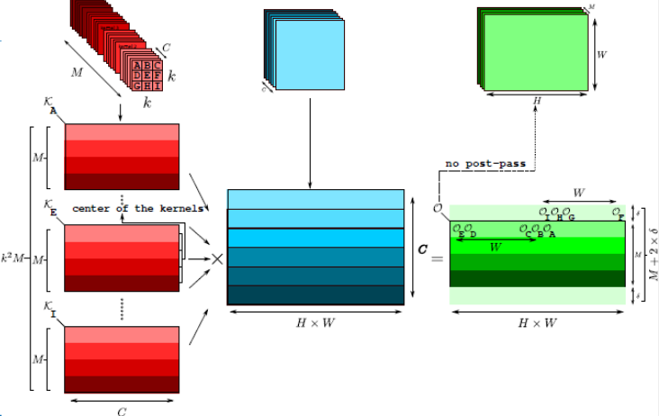
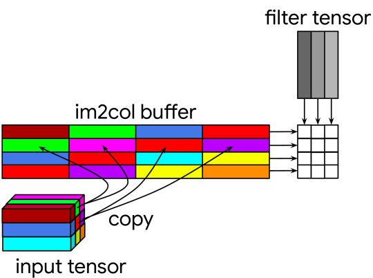
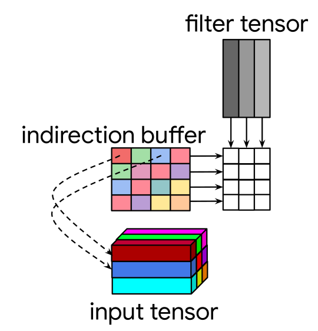
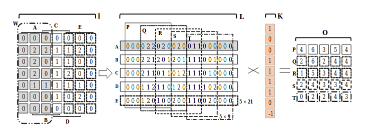
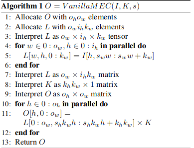
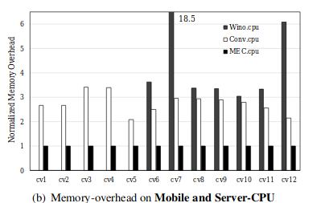
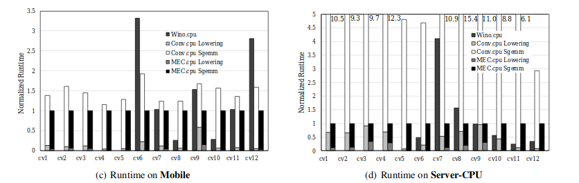

# HEART OF **DEEP** -LEARNING - II

###_Optimizing Convolution for memory limited devices_

Ashutosh Jatav (B16CS004)

## Introduction **:**

As in the first blog we have discussed how we can expressed convolution in CNN as matrix multiplication as to decrease number of floating point operations but for that we have to create a patch matrix and allocate memory for this which is not optimal so we have further analyzed how we can improve GEMM for low memory limited devices

## Methodology

###MCMK Model [6]

The disadvantage of im2col is that it replicates input data to create the input patch-matrix. For convolution with k\*k kernel, the input patch matrix can be k^2

A GEMM based MCMK algorithm that does not require data replication in the input could be useful for a memory-limited embedded system, this MCMK algorithm that eliminates data replication on the input, at the cost of some increase in the size of the output.

Im2col needs C\*H\*W\*K^2
 space for patch matrix

**GEMM-based convolution by the sum of scaled matrices**

- Scale the input image by each cell of the kernel
- Convolution becomes an addition of sub-matrices scaled by one element of the kernel, to get the right answer we need to shift the matrix entices before adding

To extend this to multiple channels replace matrix scaling with 1\*1 DNN convolution, K\*K DNN convolution can be computed as the sum of K^2
 1\*1 DNN convolution, more GEMM calls required but can be implemented without need for extra patch matrices.

**Accumulating Algorisms:**

**GEMM Accumulating Algorithm:**

Most of the algorithms deal with boundaries as special cases but here boundaries we spill into and overwrite the next row so lots of wrong values in result matrix, this can be fixed by dynamically modify input matrix with carefully-placed zeros or post-pass fix up of values

**Results:**

###Indirect Convolution Algorithm [7]

GEMM based algorithms reshuffle data to fir into GEMM interface the Indirect convolution algorithm instead modifies the GEMM primitive to adopt it to the original data layout

In indirect GEMM operation as a component of the Indirect Convolution algorithm, the indirect buffer contains only pointers to rows of the input tensor and the indirect GEMM operation reads rows of data directly from the input tensor.

An extra loop has been added to load the new pointers in the indirect buffer computes dot products of K elements specified by these pointers with the filter data and accumulates the result of the dot product.

###Memory Efficient Convolution for Deep Neural Network [8]

im2col has large amount of memory overhead because of the significant amount of redundancy in the lowered matrix and the redundancy further increase as the size of k decreases.

MEC overcome this by lowering multiple columns at once rather than each single individual sub-matrix w.r.t K. MEC copies sub-matrices W of size ih\*kw
into one row of L

For original im2col algorithm let's say our input is of size 9\*9 and kernel size 3\*3 then it will create a patch matrix of 25\*9

what this algorithm does is

At first partition I A=[0:7, 0:3] then slide W by s(1) to right  and create another partition B=[0:7, 1:4] at the end there will be 5 horizontal partitions {A, B, C, D, E} the resulting lowered matrix  l has dimensions 5\*21 which is 54% smaller than original im2col 25\*9.

Then MEC multiplies a lowered matrix with kernel K in a different way than im2col. MEC also creates another set of vertical partition {P, Q, R, S, T} within L where each partition is of size ow×khkw which is of size 5\*9, by shifting right by s
 hkw(3), then each row of output matrix O is product between one of the partitions in {P, Q, R, S, T} and K.

Intuitively MEC eliminates the vertical redundancy in conventional im2col based convolution then it recovers the information by merely shifting the vertical partitions.

**Results** :

## References

[1] CS231n Convolutional Neural Networks. [http://cs231n.github.io/convolutional-networks/](http://cs231n.github.io/convolutional-networks/), 2018

[2] Convolution in Caffe: a memo. [https://github.com/Yangqing/caffe/wiki/Convolution-in-Caffe:-a-memo](https://github.com/Yangqing/caffe/wiki/Convolution-in-Caffe:-a-memo), 2018

[3] Caffe Installation. [http://caffe.berkeleyvision.org/installation.html](http://caffe.berkeleyvision.org/installation.html), 2018

[4] Netlib BLAS. [http://www.netlib.org/blas/](http://www.netlib.org/blas/), 2018

[5] Nvidia cuBLAS. [https://developer.nvidia.com/cublas](https://developer.nvidia.com/cublas), 2018

[6] [https://ieeexplore.ieee.org/document/7995254](https://ieeexplore.ieee.org/document/7995254)

[7] [https://www.groundai.com/project/the-indirect-convolution-algorithm/1](https://www.groundai.com/project/the-indirect-convolution-algorithm/1)

[8[ https://arxiv.org/pdf/1706.06873.pdf](../../D:%5CMaterial%5CML%5C%5D%20https:%5Carxiv.org%5Cpdf%5C1706.06873.pdf)