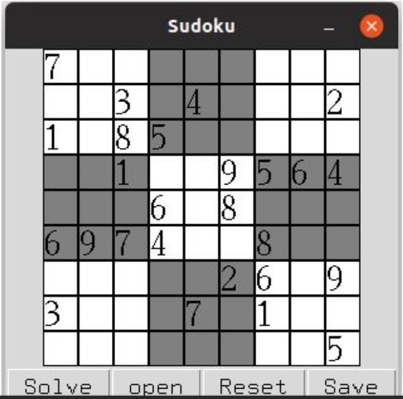

# SUDOKU SOLVER
## INTRODUCTION 

- Sudoku board contains 81 squares in which some of the boxes are initially filled
range from 1 to 9. Here the problem is to fill the remaining boxes such that no
value repeats in a row, column or 3*3 box. This problem can be easily solved
using ​ Backtracking​ and ​ Constraint Satisfaction.



### Heuristics:

 - Domain Reduction Using AC3
  
 - Minimum Remaining Value Heuristic(Partially implemented):
  
  In MRV Heuristic that cell has been filled first which has smallest domain
  after applying AC3 on all the cells. After filling the cell AC3 has been
  applied again on all the cells.
  Right now only AC3 and backtracking has been implemented no MRV heuristic </p3>
  
### USAGE: 

- Install tkinter using command:

  ```shell
    apt-get install python3-tk
  ```
    
- Run the code using:

  ```shell
    python Sudoku.py
  ```
